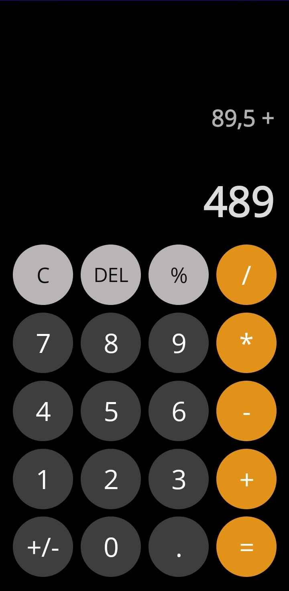

# ✨ Calculator App - .NET MAUI

This is a simple **Calculator application** built using **C# and .NET MAUI**. The app provides basic arithmetic operations and additional features to enhance user experience.

## 🚀 Features
- ➕ **Addition**
- ➖ **Subtraction**
- ✖️ **Multiplication**
- ➗ **Division**
- % **Percentage Calculation**
- ⌫ **Delete Last Input**
- ♻️ **Clear All Inputs**
- �️ **Negation of Numbers (+/-)**
- � **Decimal Point Support**
- 📊 **Real-time Calculation Display**

## 🛠️ Tech Stack
- **C#** - Programming Language
- **.NET MAUI** - Cross-platform UI Framework

## 🛠 Installation
1. Clone the repository:
   ```bash
   git clone https://github.com/ShemichAdnan/CalculatorApp.git
   cd CalculatorApp
   ```
2. Open the project in **Visual Studio**
3. Restore dependencies:
   ```bash
   dotnet restore
   ```
4. Run the application:
   ```bash
   dotnet run
   ```

## 📸 Screenshots


## 👤 Author
- **Adnan Šemić** - [GitHub](https://github.com/ShemichAdnan)
